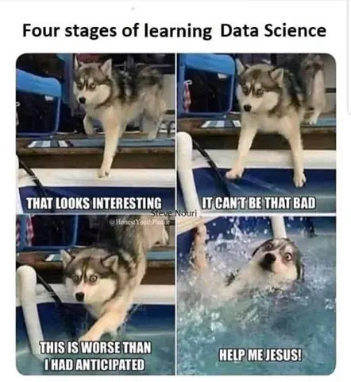

```{r setup, include=FALSE}
knitr::opts_chunk$set(echo = FALSE)
```

## Scientific Programming

### What is Scientific Programming?

**Definition**

::: {style="display: flex;"}
<div>

> Scientific programming is the use of computer programming to solve scientific problems, analyse data, and build simulations.

</div>

<div>

{width="350" height="300"}

</div>
:::

## Scientific Programming

### ... and when I say Science, I mean...

Any field where there is systematic and evidence-based approaches used to understand the natural world, the processes that govern it, and the people and creatures that live within it.

**Including...**

::: {style="display: flex;"}
<div>

-   Physical sciences
-   Life sciences
-   Computer sciences
-   Natural sciences

</div>

<div>

-   Social sciences
-   Human sciences
-   Applied sciences
-   Formal sciences

</div>
:::

## Who can it help?

Programming can assist with any research that deals with data and information.

{style="text-align: center" width="577"}

## But why would I need it...

#### 1. Many new analyses can only be implemented with code.

::: {style="display: flex;"}
-   *More researchers are using programming.*
-   *Data sources are a LOT bigger and more complicated now..*
-   *Standard data analysis software are not up to the task*

{width="292" height="225"}
:::

## But why would I need it...

#### 2. Your analysis needs to be repeated on multiple data sets, or data sets that are regularly updated.

::: {style="display: flex;"}
<div>

-   *Data cleaning can be extremely time-consuming and onerous and not feasible to be repeated multiple times.*

-   *Repeating analyses perfectly consistently can be tricky with standard software.*

-   *Real-time analysis may be needed for dynamic data sets.*

</div>

{width="500" height="250"}
:::

## But why would I need it...

#### 3. You want to develop your data analytic skills

::: {style="display: flex;"}
-   *Programming skills are highly desired*

-   *Boosts productivity*

-   *See it as a long-term investment into your own career development.*

{width="350"}
:::

## Why not?

### It is not easy to learn a programming language.

{width="359"}

## Why not?

### Programming is not always a time-saver.

{width="376"}

# What does programming in research look like?

## Example: NSW BMI Study

The data sets in question, `NSW_income.csv`, `house_coord.csv` and `bmi_study.rds` contain synthetic observations based on 2016 table builder personal income estimates of NSW adults (15+) with a recorded non-negative personal income and a generated linear mixed effects modelled data. `NSW_income.rds` and `bmi_study.rds` contains individual level information, whereas `house_coord.rds` contains household address information.

**This is not REAL data but simulated for the purposes of teaching.**

## Example: NSW BMI Study

::: {style="font-size:16pt;"}
The `bmi_study` data set pertains to a synthetic longitudinal study of individuals from the `NSW_income` data set which assesses the effectiveness of three treatment options in reducing the BMI of overweight individuals over 5 months. The study recorded the changes in BMI from initial values at the end of each month after receiving one of three treatment options:

1.  No Treatment (Control)
2.  Diet Therapy
3.  Diet Therapy and Exercise Regime

We aim to conduct an analysis considering how treatment effected the change in BMI seen over the 5 months whilst accounting for demographic factors including age, sex, socioeconomic status and geographical remoteness.
:::

## Script

[View Script](script.html)

# Which statistical programming package is best?

## Choosing a Statistical Package

**Why do you need a statistical package?**

-   Data manipulation

-   Descriptive statistics

-   Visualisation

-   Modeling/inference

-   Teaching

**What is your research question?**

**What does your data look like?**

## What is your research question?

-   Are you describing a sample/population?

-   Are you looking at differences or relationships between groups?

-   Is visualisation (pretty figures and graphs) important?

-   Are you analysing survey data?

-   Are you investigating a change over time?

-   Is there missing data?

-   Is there clustered/multilevel data?

-   Will your model be complicated?

## What does your data look like?

-   How big is your dataset?

    -   Can you do it on your laptop? Do you need special computing facilities, high performance computing.

-   Do you have to link datasets?

-   Is your data complicated (linked, relational, administrative)

-   Are you going to be working on this project for a long time?

-   Are you working with collaborators in other schools, disciplines, UOW (different packages)?

## What are your options?

### There are LOTS of stats programs...

{width="420"}

## Some open source options...

::: {style="font-size:7pt; display:flex;"}
-   ADaMSoft -- a generalized statistical software with data mining  and data management

-   ADMB -- non-linear statistical modeling

-   Chronux -- for neurobiological time series data

-   DAP -- free replacement for SAS

-   Environment for DeveLoping KDD-Applications Supported by Index-Structures (ELKI)  data mining in Java

-   Epi Info -- statistical software for epidemiology developed by the CDC]

-   Fityk -- nonlinear regression software

-   GNU Octave -- programming language very similar to MATLAB with statistical features

-   gretl -- gnu regression, econometrics and time-series library

-   intrinsic Noise Analyzer (iNA) -- analyzing intrinsic fluctuations in biochemical systems

-   **JASP** -- A free software alternative to IBM SPSS Statistics with additional option for Bayesian methods

-   **Just another Gibbs sampler (JAGS)** -- a program for analyzing Bayesian hierarchical models

-   JMulTi -- For econometric analysis, univariate and multivariate time series analysis

-   KNIME -- analytics platform built with Java and Eclipse using modular data pipeline workflows

-   LIBSVM -- C++ support vector machine libraries

-   **mlpack** -- open-source library for machine learning

-   Mondrian -- data analysis & interactive statistical graphics with a link to R

-   Neurophysiological Biomarker Toolbox -- data-mining of neurophysiological biomarkers

<div>

-   **OpenBUGS**

-   OpenEpi -- epidemiology and statistics

-   OpenNN --  neural networks,,  deep learning 

```{=html}
<!-- -->
```
-   OpenMx -- A package for structural equation modeling running in R (programming language)

-   Orange, a data mining, machine learning, and bioinformatics software

-   **Pandas** -- High-performance computing (HPC) data analysis tools for Python in Python and Cython (statsmodels, scikit-learn)

-   Perl Data Language -- Scientific computing with Perl

-   Ploticus -- software for generating a variety of graphs from raw data

-   PSPP -- A free software alternative to IBM SPSS Statistics

-   **R** -- free implementation of the S (programming language)

-   ROOT -- data storage, processing and analysis, developed by CERN and used to find the Higgs boson

-   Salstat -- menu-driven statistics software

-   **SciPy** -- Python library for scientific computing

-   scikit-learn -- extends SciPy with a host of machine learning models (classification, clustering, regression, etc.)

-   statsmodels -- extends SciPy with statistical models and tests

-   Shogun, large-scale machine learning toolbox that provides several SVM (Support Vector Machine) implementations

-   Simfit -- simulation, curve fitting, statistics, and plotting

-   SOFA Statistics -- desktop GUI program focused on ease of use, learn as you go, and beautiful output

-   Stan (software) -- open-source package for obtaining Bayesian inference

-   **Statistical Lab** -- R-based and focusing on educational purposes

-   TOPCAT -- graphical analysis and manipulation package for astronomers.

-   **Torch**  -- a deep learning software library written in Lua

-   **Weka** -- machine learning software

</div>
:::

## Some proprietary options...

::: {style="font-size:7pt; display:flex;"}
<div>

-    Alteryx -- statistical models; R and Python integration
-   Analytica -- visual analytics and statistics package
-   Angoss -- data mining algorithms
-   **ASReml** -- for restricted maximum likelihood analyses
-   BMDP -- general statistics package
-   DataGraph -- visual analysis and regression
-   DB Lytix -- 800+ in-database models
-   EViews -- for econometric analysis
-   FAME (database) -- managing time-series databases
-   GAUSS -- programming language for statistics
-   Genedata --experimental data in life science R&D
-   **GenStat -- general statistics package**
-   GLIM -- generalized linear models
-   **GraphPad** InStat --
-   **GraphPad Prism** -- biostatistics nonlinear regression
-   IMSL Numerical Libraries -- software library
-   **JMP** -- visual analysis and statistics package
-   LIMDEP -- statistics and econometrics
-   LISREL -- structural equation modeling
-   **Maple** -- programming language with statistical features

</div>

<div>

-   Mathematica -- some statistical features
-   **MATLAB** -- programming language with statistics
-   MaxStat Pro -- general statistical software
-   MedCalc -- for biomedical sciences
-   Microfit -- econometrics package, time series
-   **Minitab** -- general statistics package
-   MLwiN -- multilevel models (free to UK academics)
-   Nacsport Video Analysis Software -- analysing sports
-   NAG Numerical Library -- math and statistics library
-   Neural Designer -- commercial deep learning package
-   NCSS -- general statistics package
-   NLOGIT -- statistics and econometrics package
-   nQuery Sample Size Software -- Sample Size/Power
-   O-Matrix -- programming language
-   OriginPro -- statistics and graphing,
-   PASS Sample Size Software (PASS) -- power/sample size
-   **Plotly** -- plotting library fo R, Python, MATLAB, Julia, Perl
-   Primer-E Primer -- environmental and ecological specific
-   PV-WAVE -- data analysis/visualization

</div>

<div>

-   Qlucore Omics Explorer -- data analysis software
-   RapidMiner -- machine learning toolbox
-   Regression Analysis of Time Series (RATS) -- econometrics
-   **SAS (software**) -- comprehensive statistical package
-   SHAZAM-- econometrics and statistics package
-   Simul -- econometric tool multidimensional modeling

```{=html}
<!-- -->
```
-   SigmaStat -- package for group analysis
-   **SmartPLS** --  partial least squares path modeling (PLS)
-   SOCR -- teaching statistics and probability theory
-   Speakeasy -- statistical and econometric analysis features
-   **SPSS Modeler** -- data mining and text analytics workbench
-   **SPSS Statistics** -- comprehensive statistics package
-   **Stata** -- comprehensive statistics package
-   StatCrunch -- comprehensive statistics package
-   Statgraphics -- general statistics package
-   **Statistica** -- comprehensive statistics package
-   StatsDirect -- statistics for public health, health science
-   StatXact -- exact nonparametric and parametric statistics
-   Systat -- general statistics package
-   SuperCROSS -- comprehensive statistics package
-   **S-PLUS** -- general statistics package
-   Unistat -- general statistics package
-   The Unscrambler -- multivariate analysis 
-   WarpPLS -- structural equation modeling
-   **Wolfram Language[6]** -- some statistical capabilities
-   **World Programming System (WPS)** -- supports use of Python, R and SAS within single user program.
-   XploRe

</div>
:::

## But really ... which ones are used?

### AT UOW, THESE ARE THE MOST COMMONLY USED

::: {style="display:flex;"}
<div>

[**Code**]{.underline}

-   **R**

-   **Python**

-   **C++**

</div>

::: {style="padding:50pt;"}
:::

<div>

[**GUI**]{.underline}

-   **SPSS**

-   **SAS**

-   **STATA**

-   **Jamovi**

</div>
:::

### Note: Excel has been omitted 

## R and RStudio

### Pros

::: {style="font-size:14pt;"}
-   Free and open source
-   Released in 1995 developed by Ross Ihaka and Robert Gentleman at the University of Auckland, based on the S Plus software package
-   Relies on active user community to develop and maintain discipline specific packages
-   R open source programming language designed for statistical analysis
-   R is not often used stand alone, ubiquitously used through and Integrated Development Environment (IDE) RStudio most widely used
-   R Studio has a commercial arm which supports business and funds the free development.
-   Extensive standard and advanced statistical methods
-   Constantly increasing number of statistical packages, discipline specific packages
-   You can develop your own statistical package
-   Encourages reproducible research
:::

## R and RStudio

### Cons

<div>

-   Steep learning curve
-   Dependencies, relies on user community to maintain packages
-   Some packages dependent on others may cease working
-   Work arounds require advanced knowledge (note that can at least save the versions used as part of RR)
-   Changing constantly -- stay up to date
-   Base R versus the Tidyverse

</div>

## R User Interfaces

#### There are many of these:

-   Jamovi <https://www.jamovi.org/>
-   JASP <https://jasp-stats.org/>
-   BlueSky <https://blueskystatistics.com>
-   Rcommander <https://socialsciences.mcmaster.ca/jfox/Misc/Rcmdr/>
-   R-Instat [https://www.r-instat.org](https://www.r-instat.org){style="font-size: 11pt;"}
-   Deducer [https://www.deducer.org](https://www.deducer.org){style="font-size: 11pt;"}
-   RKWard <https://rkward.kde.org/>
-   Rattle <https://rkward.kde.org/>
-   RAF <https://r.analyticflow.com/en/>

## Python

### Pros

::: {style="font-size:14pt;"}
-   Open source general-purpose programming language, cross-platform.
-   Released in 1989, developed by Guido van Rossum at Centrum Wiskunde & Informatica in the Netherlands named after Monty Python.
-   Nice interface with low-level languages and GPU acceleration.
-   Used extensively in web development.
-   Gained popularity for machine learning/ deep learning/data science.
-   Supported by user community.
-   Used in scalable production environments.
-   Many libraries are available.
-   Can be used in IDE and others like Jupyter: Web-based, interactive computing notebook environment.
-   Can be run local or server (Google colaboratory)0
-   No braces, no semi-colons, indentation is used to structure code.
-   Currently Number 1 programming language <https://www.tiobe.com/tiobe-index/>
:::

## Python

### Cons

-   Not as many stats packages as R (though many general programming packages).
-   No braces, no semi-colons, indentation is used to structure code.
-   Still a steep learning curve.
-   Reading someone else's code can be tough for beginners.
-   Visualisations possible but not as good as others ( R ).
-   High memory usage.

## IBM SPSS Statistics

### Pros

-   Statistical Package for the Social Sciences, first released 1968.
-   Widely used in teaching.
-   Many online resources.
-   Menu driven GUI.
-   Good for standard and common advanced methods.
-   Nice missing data/multiple imputation options.
-   Bayesian analyses.
-   New workbook facility incorporating syntax in version 28.

## IBM SPSS Statistics

### Cons

-   Menu use is repetitive and time consuming, switch to syntax if using frequently.
-   Requires labour intensive cleaning, coding, and manipulation.
-   Outputs everything for some analyses, can be overwhelming.
-   Graphing capacity is limited but editable.
-   Major interface change is currently in beta testing.
-   Syntax coding is awful. *-Personal opinion of mine*
-   Restricted access at UOW.

## SAS

### Pros

-   Commercial product developed from 1966-76, SAS Institute Inc.
-   Substantial investment in AI and business analytics.
-   Great for large scale linked administrative data.
-   Gold standard for pharmaceutical trials and governments.
-   Runs on code line using DATA and PROC statements.
-   Available free for academic use if used in the cloud.
-   SAS® OnDemand for academics.
-   SAS Studio has pull down menu options.

## SAS

### Cons

-   Menu driven SAS Studio not as intuitive as other packages
-   Learning the code, unique to SAS.
-   Not very intergratable with other programming pipelines.
-   Less and less people are using it now.
-   Limited analyses, simulations, and coding.
-   Undergoing generational change as new analysts come through
-   Restricted access at UOW.

## STATA

### Pros

-   First released in 1985, StataCorp, Bill Gould
-   Code driven and GUI
-   Reasonably priced for academics/students
-   Good for standard and many advanced methods including robust analysis
-   Nice for survey analysis, many Australian surveys have STATA code for weighting
-   Some user written ado files
-   Used extensively in epidemiology, public health, social science
-   Choice of old school statisticians.

## STATA

### Cons

-   Learning the code unique to STATA.
-   Menu driven options not as user friendly as other packages.
-   Only used in some discipline areas.
-   Not very intergratable with other programming pipelines.
-   Less and less people are using it now.
-   Limited analyses, simulations, and coding.
-   No access at UOW!

## What about EXCEL?

### DO NOT USE EXCEL FOR DATA ANALYSIS

::: {style="display:flex;font-size:13pt;"}

-   No capacity to store code of changes made

-   Analysis is not reproducible

-   Formulas are hidden in cells and can be accidentally overwritten

-   Easy to accidentally change numbers and no way to trace this

-   Limited data size

-   Encourages chartjunk

-   "Friends don't let Friends use excel for statistics"  (Cryer, <http://citeseerx.ist.psu.edu/viewdoc/download?doi=10.1.1.617.4297&rep=rep1&type=pdf> )

{width="300" height="250"}
:::

# An R Demonstration....

# Where to from here...

## Our Workshops

### The Statistical Consulting Centre runs workshops.

**Introduction to R and RStudio -** RunningNext Week

-   Online two half day workshop 9:30am-12:30pm
-   Monday and Tuesday 27th and 28th March
-   **Registrations still open!!**
-   \$110 or \$100 from internal account

## Our Workshops

**Introduction to SPSS**

-   One day 9:30am - 4:30pm in-person workshop
-   Monday 24th April
-   **Registrations open soon** (in next day or two)
-   \$110 or \$100 from internal account

## Our Workshops

**Effective Data Visualisation with ggplot2 for Beginners**

-   Online two half day workshop 9:30am-12:30pm
-   Monday and Tuesday 1st and 2nd May
-   **Registrations open soon**
-   \$110 or \$100 from internal account

## We're here to help...

{width="602"}

#### Aim

The service aims to improve the statistical content of research carried out by members of the University. Researchers from all disciplines may use the Centre. Priority is currently given to staff members and postgraduate students undertaking research for Doctor of Philosophy or Masters' degrees.

## We're here to help...

#### How can we help?

Currently the Statistical Consulting Centre provides each post-graduate student with a free initial consultation. Up to ten hours per calendar year of consulting time is provided without charge if research funding is not available. When students require more consulting time, or receive external funding, a service charge may be necessary.

#### What do we help with?

+--------------------------------------+--------------------------------------+
| -   **The planning of experiments,** | -   **Data entry and management,**   |
|                                      |                                      |
| -   **Designing questionnaires,**    | -   **Statistical analyses,**        |
|                                      |                                      |
| -   **Data collection,**             | -   **The presentation of results.** |
+--------------------------------------+--------------------------------------+

## To book a consultation...

{width="700"}

{width="640" height="33"}](images/image-1864249523.png){width="577"}

**Just Google NIASRA and follow the prompts!**

## Any other queries...

{width="679"}
